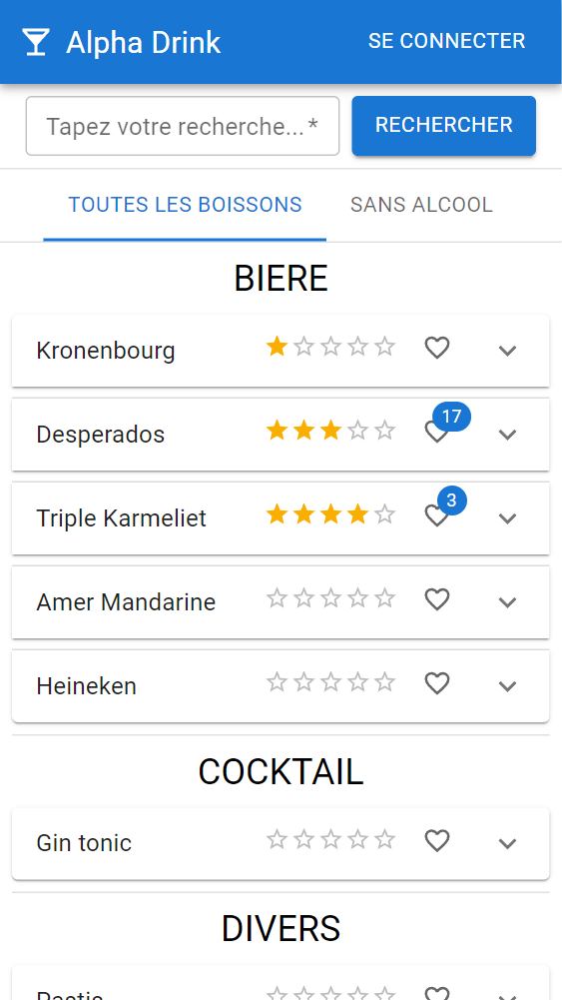
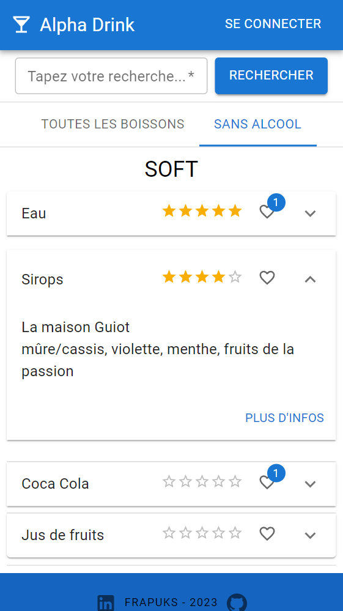
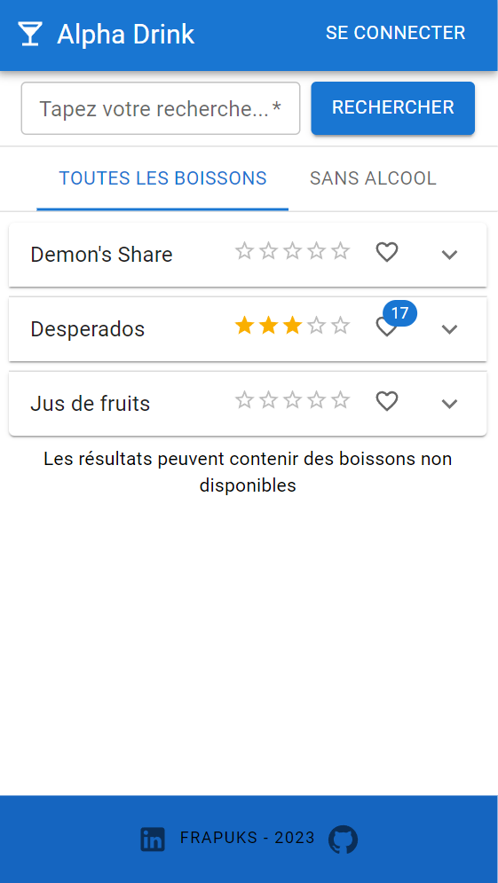
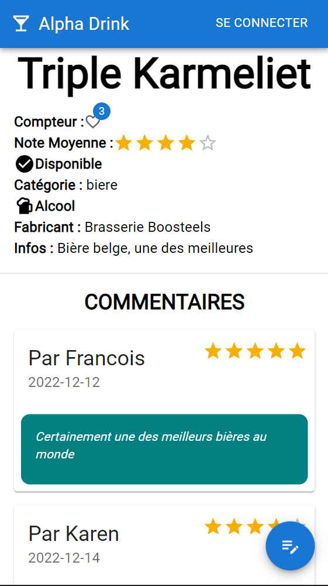
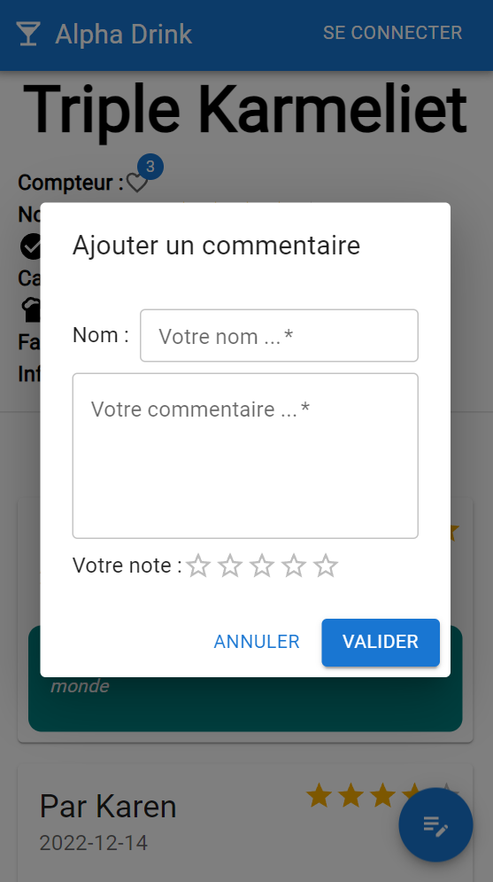
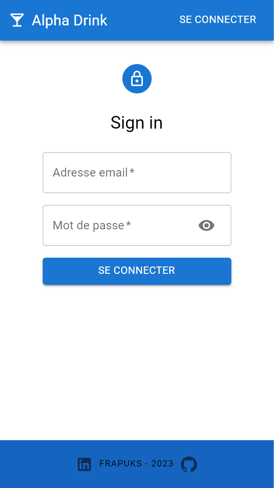
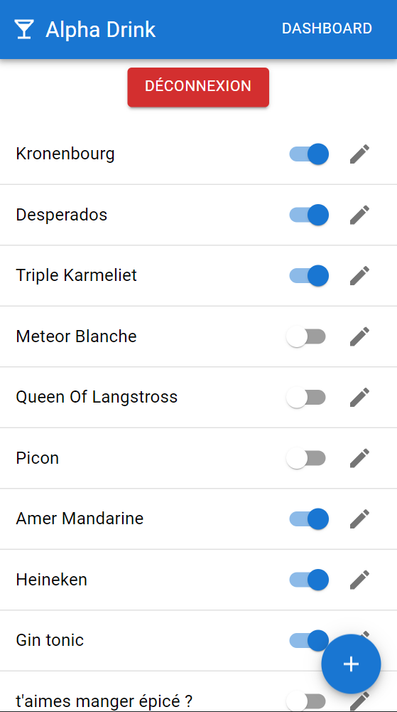
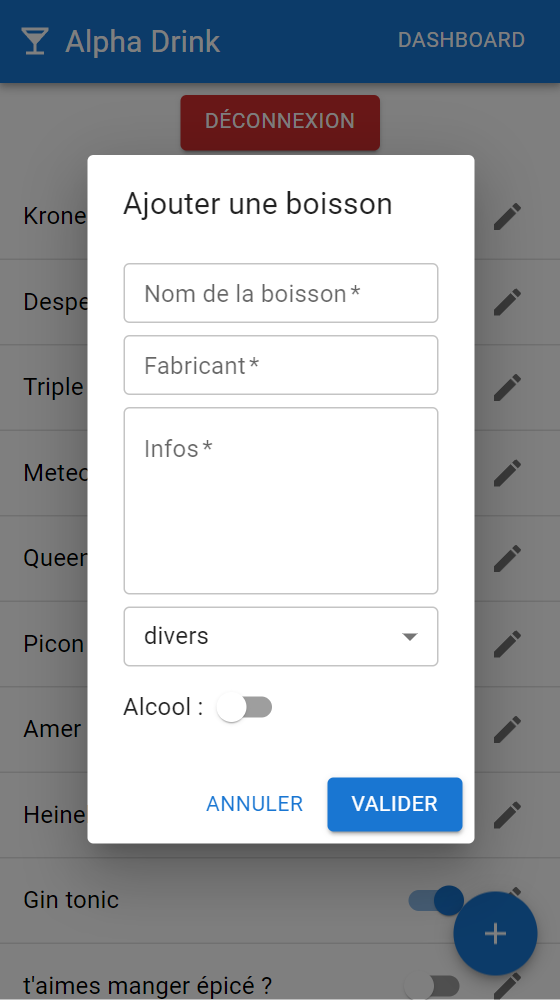

# ALPHA DRINK

Application privée destinée à la gestion d'une carte de boissons.

API : [API Alpha Drink](https://github.com/frapuks/AlphaDrink-API)

# Présentation

Cette application est destiné a l'usage privé d'une carte de boissons personnelle. Elle permet de présenter de manière interactive a vos invités les boissons disponibles à la manière d'un restaurant.

Nous vivons tous ce moment gênant (et amusant) lorsque nous demandons poliment ce qu'ils veulent boire, qu'ils demandent ce qu'on a, que nous nous lançons dans une liste non exhaustive de toutes les boissons de notre frigo en oubliant la moitié, pour au final que nos invités choisissent un coca ou de l'eau tellement ils sont noyés dans le choix.

Avec cette application, tout le monde est gagnant :

- Vos invités peuvent prendre le temps de choisir
- Vous n'oubliez rien (pas même la bouteille de Suze de mamie qui traine au fond du placard)

# Technologies utilisées

- HTML
- CSS
- Javascript
- React
- Material UI

# Auteurs

- [François G.](https://github.com/frapuks)

# Version

- v1 : App EJS opérationnelle sur localhost ([Github AlphaDrink v1](https://github.com/frapuks/Alpha-drink))
- v2 (actuelle) : App React consommant une API Node connectée a une BDD PostgreSQL
- A venir : Déploiement sur Raspberry Pi avec Docker

# Page d'accueil

- Consultation de la liste des boissons triées par catégories
- Affichage par défaut des infos principales d'une boisson
- Ajout d'un like
- Affichage des infos secondaires d'une boisson au click
- Redirection vers la page d'une boisson au click sur un bouton "Plus d'infos"
- Filtrage avec ou sans alcool pour faciliter l'accès aux personnes ne souhaitant pas boire d'alcool
- Formulaire de recherche par nom de boisson
- Bouton de connexion

# Page de recherche

- Consultation des resultats de la recherche
- Filtrage avec ou sans alcool
- Formulaire de recherche

# Page d'une boisson

- Affichage de toutes les infos d'une boisson
- Affichage des commentaires
- Bouton d'action permettant de poster un commentaire et une note sur cette boisson
- Formulaire de modification/suppression d'une boisson (Admin uniquement)
- Bouton de suppression d'un commentaire (Admin uniquement)

# Page de connexion

- Uniquement destiné à l'administrateur
- Formulaire de connexion
- Affichage/Masquage du mot de passe

# Dashboard

- Bouton de déconnexion
- Affichage de la liste des boissons
- Switch permettant de rendre disponible/indisponible une boisson
- Bouton d'édition revoyant vers la page d'une boisson
- Bouton d'action permettant d'ajouter une boisson

